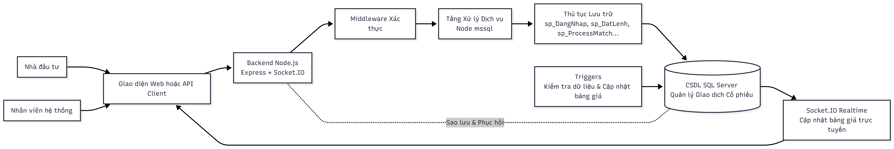
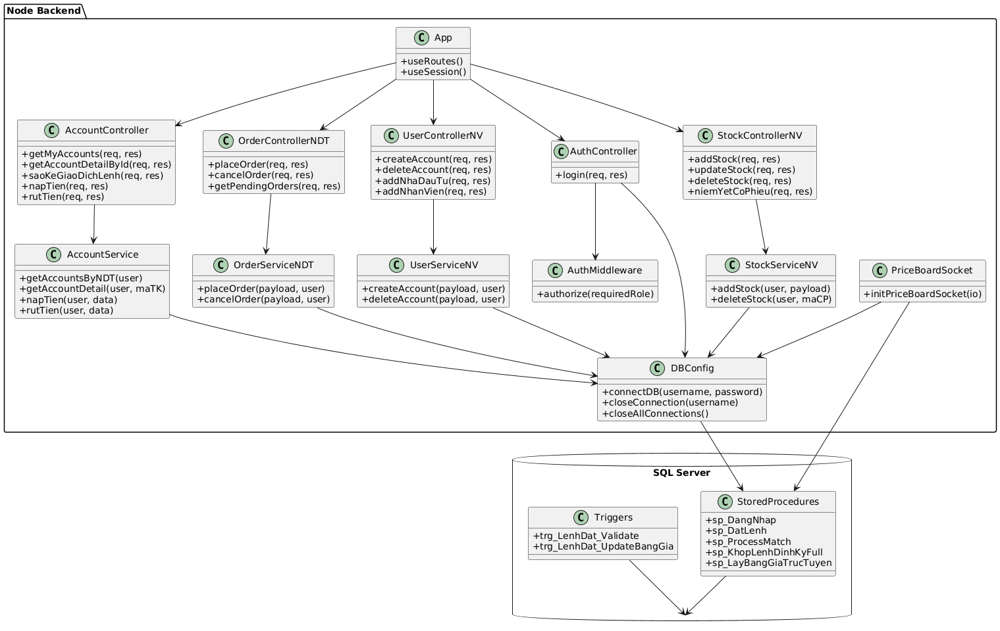
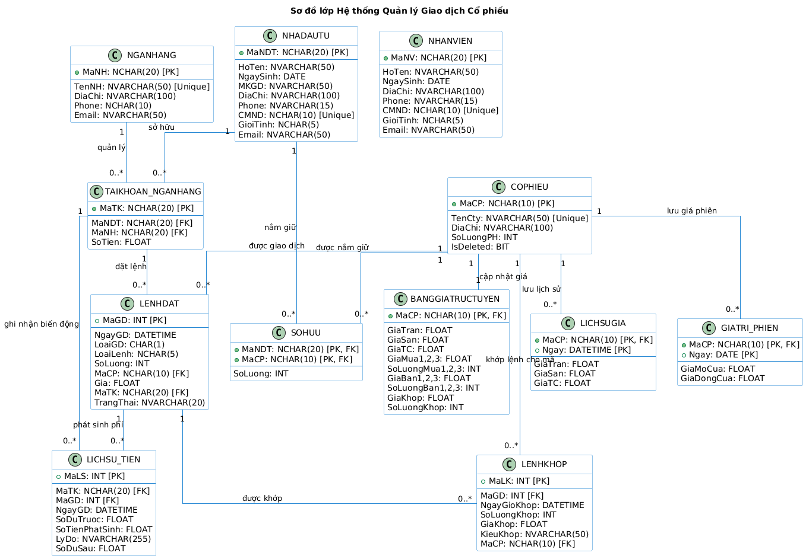

# Stock Realtime Backend (Node.js + MSSQL)

[Tiếng Việt](./README.vi.md) | **English**

Backend API for a realtime stock trading system.

The core of this project: **Node.js acts only as an API gateway**, while important business logic (SQL login authentication, order placement conditions, order matching, balance updates, statements, price boards, backup/restore) is handled primarily within **Microsoft SQL Server** using **stored procedures + triggers + transactions**.

## 1. Overall Architecture

- Backend: `Node.js + Express + Socket.IO + mssql`.
- Database: `SQL Server`.
- Realtime: Socket.IO calls SP to fetch the price board every 5 seconds.
- Authorization: 2 main business roles: `nhadautu` (investor) and `nhanvien` (staff).

Processing flow:

1. Client logs in using SQL Login (`username/password`).
2. Backend connects to SQL Server using the user's own credentials.
3. Calls `sp_DangNhap` to determine the role.
4. Issues a JWT and uses middleware to protect routes.
5. All trading/stock operations call down to SQL Server stored procedures.

Overall architecture diagram:



## 2. Source Code Structure

```text
src/
  app.js                    # Middleware and route declarations
  index.js                  # HTTP server + Socket.IO creation
  config/db.js              # Connection pool management based on logged-in user
  middleware/authMiddleware.js
  utils/jwt.js
  routes/                   # Routers grouped by nhadautu/nhanvien
  controllers/              # Input validation + service calls
  services/                 # SQL stored procedure calls / queries
  socket/priceBoardSocket.js
```

Backend class diagram:



## 3. MSSQL as the Business Core

This project utilizes various MSSQL theoretical concepts in practice:

- Transaction data relationship design: `LENHDAT`, `LENHKHOP`, `SOHUU`, `TAIKHOAN_NGANHANG`, `LICHSU_TIEN`, `BANGGIATRUCTUYEN`, `GIATRI_PHIEN`, `LICHSUGIA`.
- Use of `stored procedures` to encapsulate business logic and ensure data consistency.
- Use of `triggers` to enforce rules (valid price/volume, updating top 3 price levels).
- Use of transactions/try-catch in SPs to ensure integrity during order matching.
- Use of roles/logins in SQL Server to separate permissions by user group.
- Backup/restore module and point-in-time recovery via T-SQL commands.

Database ERD:



## 4. Setting up MSSQL for the Project

### 4.1 Creating Database and Schema

- Main schema script: `QL_GiaoDichCoPhieu.sql`.
- Business matching/trigger scripts: `full.sql`, `sp_trg_LO.sql`.

Recommended order:

1. Run `QL_GiaoDichCoPhieu.sql` to create tables.
2. Run `full.sql` (or your standard script) to create business logic triggers/SPs.
3. Seed sample data (if a separate script is available in your environment).

### 4.2 Setup SQL Login, User, Role (Auth in MSSQL)

The backend currently logs in using SQL accounts, so it is necessary to create logins/users for each user correctly.

Minimum example (for reference):

```sql
-- 1) Create server-level login
CREATE LOGIN NDT001 WITH PASSWORD = 'YourStrongPassword!123';
CREATE LOGIN NV001 WITH PASSWORD = 'YourStrongPassword!123';

-- 2) Map to database
USE QL_GiaoDichCoPhieu;
GO
CREATE USER NDT001 FOR LOGIN NDT001;
CREATE USER NV001 FOR LOGIN NV001;

-- 3) Assign roles based on system model
CREATE ROLE nhadautu;
CREATE ROLE nhanvien;
ALTER ROLE nhadautu ADD MEMBER NDT001;
ALTER ROLE nhanvien ADD MEMBER NV001;

-- 4) Grant EXEC SP permissions by role (example)
GRANT EXECUTE ON OBJECT::sp_DangNhap TO nhadautu;
GRANT EXECUTE ON OBJECT::sp_DangNhap TO nhanvien;
```

Note:

- User/login names should sync with business codes (`MaNDT`, `MaNV`) for easier logic mapping.
- In the current code, the backend calls `sp_DangNhap` and reads `TENNHOM` to determine the role.
- User management APIs use `sys.database_principals` to check if the account is registered in the DB.

## 5. Main Stored Procedures and Triggers

### 5.1 Matching Procedures in SQL Scripts

According to existing SQL files (`full.sql`, `sp_trg_LO.sql`), core SPs include:

- `sp_KiemTraDieuKienDatLenh`
- `sp_DatLenhLO`
- `sp_DatLenhATO`
- `sp_DatLenhATC`
- `sp_KhopLenhDinhKy`
- `sp_DatLenh`
- `sp_ProcessMatch`
- `sp_XoaCoPhieu`
- `sp_KhopLenhLienTuc` (in `sp_trg_LO.sql`)

### 5.2 Main Triggers

- `trg_LenhDat_Validate` or `trg_LenhDat_ValidateRules`: checks price/volume rules.
- `trg_LenhDat_UpdateBangGia`: updates the best 3 buy/sell price levels on the realtime board.

### 5.3 Procedures Called by Node.js Backend

From `src/services` code, the backend calls the following SPs (must exist in the DB):

- Auth: `sp_DangNhap`
- Investor: `sp_DatLenh`, `sp_HuyLenh`, `sp_GetAccountsByNDT`, `sp_TraCuuSoDu`, `sp_SaoKeGiaoDichLenh`, `sp_SaoKeLenhDatTheoMaCP`, `sp_SaoKeGiaoDichTien`, `sp_SaoKeLenhKhop`, `sp_ThemTaiKhoanNganHang`, `sp_NapTien`, `sp_RutTien`, `sp_DoiMatKhauGiaoDich`, `sp_XemGia`
- Staff: `sp_KhopLenhDinhKyFull`, `sp_TaoTaiKhoan`, `sp_XoaTaiKhoan`, `sp_DoiMatKhau`, `sp_ThemNhaDauTu`, `sp_XoaNhaDauTu`, `sp_ThemNhanVien`, `sp_XoaNhanVien`, `sp_NiemYetCoPhieu`, `sp_GoNiemYetCoPhieu`, `sp_XoaCoPhieu`
- Realtime price board: `sp_LayBangGiaTrucTuyen`

## 6. Installation and Running Backend

```bash
npm install
```

### 6.1 Environment Variables

Create `.env`:

```env
PORT=3000

SESSION_SECRET=your_session_secret
JWT_SECRET=your_jwt_secret
JWT_EXPIRES_IN=1d

DB_SERVER=localhost
DB_DATABASE=QL_GiaoDichCoPhieu
DB_PORT=1433
```

Notes:

- `DB_USER/DB_PASS` are not fixed because the backend uses the `username/password` from the SQL Server user for each login.

### 6.2 Running the Server

```bash
# Development
npm run dev

# Production
npm start
```

The server runs by default at `http://localhost:3000`.

## 7. Authentication and API Permissions

- Login: `POST /api/auth/login`
- Route protection header: `Authorization: Bearer <token>`
- Role-based authorization middleware:
  - `nhadautu` for `/api/nhadautu/*` routes
  - `nhanvien` for `/api/nhanvien/*` routes

Login example:

```json
{
  "username": "NDT001",
  "password": "12345678"
}
```

## 8. Main API Groups

### 8.1 Investor (`/api/nhadautu`)

- Manage bank accounts, deposit/withdraw money, change trading passwords.
- Place/cancel orders and view pending orders.
- Query order statements, cash statements, matching statements.
- Query stock portfolios and view prices.

Place order example:

```json
{
  "maCP": "VNM",
  "ngay": null,
  "loaiGD": "M",
  "soLuong": 100,
  "gia": 65000,
  "maTK": "TK001",
  "loaiLenh": "LO",
  "mkgd": "123456"
}
```

### 8.2 Staff (`/api/nhanvien`)

- Admin SQL users/logins and investor/staff lists.
- Manage stocks, list/delist stocks.
- Monitor order/matching/transaction history data.
- Trigger ATO/ATC periodic matching.
- Database backup/restore and point-in-time recovery.

## 9. Price Board Realtime Socket

- File: `src/socket/priceBoardSocket.js`
- Events:
  - Client sends `auth` with `username/password`
  - Server emits `bangGiaUpdate`
  - Client can call `requestPriceBoard`
- The server updates periodically every `5s` using the `sp_LayBangGiaTrucTuyen` SP.

## 10. Technical Notes

- `config/db.js` creates a connection pool for each `username:password` pair.
- Includes `graceful shutdown` to close all pools when the app stops.
- Services handle `trim()` for `NCHAR` types returned from SQL Server.
- Some undo/redo functions are currently stored using an in-RAM stack, not persistent after server restart.

## 11. Security and Recommendations

This project is suitable for academic/project demos. For production deployment:

1. Do not include SQL user passwords in JWT payload.
2. Limit logging of full request headers/body in production.
3. Enable HTTPS and configure `secure cookies`.
4. Apply secret rotation, audit SQL permissions, and use a separate service account.

## 12. Script Documentation in Repo

- `QL_GiaoDichCoPhieu.sql`: main data table schema.
- `full.sql`: matching business triggers + SPs.
- `sp_trg_LO.sql`: SPs/triggers specialized for LO/continuous matching flow.
- `full cũ chạy ngon.sql`: old script version for reference.
